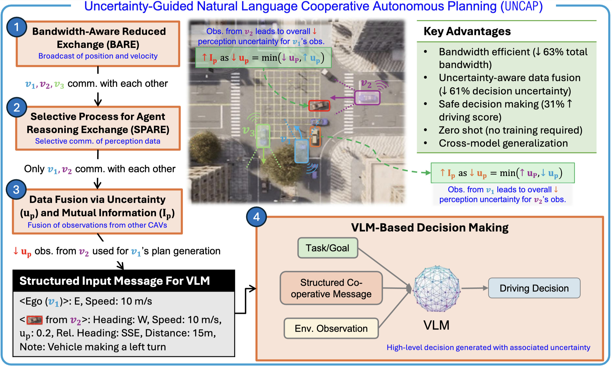

# UNCAP: Uncertainty-Guided Neurosymbolic Planning Using Natural Language Communication for Cooperative Autonomous Vehicles

<p align="center">
    <a href="https://neel1302.github.io/">Neel P. Bhatt*</a>
    ·
    <a href="https://d31003.github.io/">Po-han Li*</a>
    ·
    <a href="https://scholar.google.com/citations?user=JfH0nfEAAAAJ&hl=en">Kushagra Gupta*</a>
    ·
    <a href="https://www.linkedin.com/in/rohan-siva">Rohan Siva</a>
    <br>
    <a href="https://www.linkedin.com/in/milan-daniel/">Daniel Milan</a>
    ·
    Alexander T. Hogue
    ·
    <a href="https://utaustin-swarmlab.github.io/people/sandeep_chinchali/index.html">Sandeep P. Chinchali</a>
    ·
    <a href="https://clearoboticslab.github.io/people/david_fridovich-keil/index.html">David Fridovich-Keil</a>
    <br>
    <a href="https://express.adobe.com/page/CAdrFMJ9QeI2y/">Zhangyang Wang</a>
    ·
    <a href="https://www.ae.utexas.edu/people/faculty/faculty-directory/topcu">Ufuk Topcu</a>
    <br>
    <b>The University of Texas at Austin</b>
    <br>
    <em>*Equal contribution</em>
    <br>
    <b><i>AAMAS 2026 (Oral; Best Paper Nomination)</i></b>
    <h3 align="center">
        <a href="https://uncap-project.github.io/">Project Page</a> |
        <a href="https://arxiv.org/abs/2510.12992">arXiv</a> |
        <a href="https://openreview.net/forum?id=aYlKa5ppLh">OpenReview</a>
    </h3>
</p>

---

## TL;DR
UNCAP is a **neurosymbolic planning framework for cooperative autonomous vehicles** that uses **natural language communication + uncertainty reasoning** to improve multi-agent coordination under partial observability.

It enables vehicles to:
- Communicate **what they know (and don’t know)** in natural language  
- Perform **uncertainty-aware planning**  
- Achieve more **robust and safer cooperation** in complex driving scenarios  

---

## Framework Overview



Autonomous vehicles operating in multi-agent environments face two key challenges:
1. **Partial observability** (each agent has limited perception)
2. **Uncertainty in other agents’ intentions and environment state**

### Key Idea

UNCAP introduces a **neurosymbolic pipeline** that combines:
- **Perception (deep models)**  
- **Symbolic reasoning (planning under uncertainty)**  
- **Natural language communication (LLMs)**  

### Core Components

- **Uncertainty Estimation**  
  Quantifies confidence in perception and predictions.

- **Language-Based Communication**  
  Agents exchange structured natural language messages describing:
  - Observations  
  - Uncertainty  
  - Intentions  

- **Neurosymbolic Planner**  
  Integrates communicated information into a **joint planning process**.

- **Cooperative Decision-Making**  
  Produces safer and more efficient multi-agent trajectories.

---

## Setup

### 1. Install Dependencies

Follow installation for:
- [OpenCOOD](OpenCOOD/README.md)  
- [CARLA 0.9.13](https://carla.readthedocs.io/en/0.9.13/)

### 2. Environment Setup

```bash
conda activate opencood

pip install ultralytics
pip install openai
pip install python-dotenv
```

Demo Notebook in: [OPV2V/run.ipynb](OPV2V/run.ipynb)

## Citation

If you find this work interesting and use it in your research, please consider citing our paper.

```bibtex
@inproceedings{bhatt2025uncap,
            title={{UNCAP}: Uncertainty-Guided Planning Using Natural Language Communication for Cooperative Autonomous Vehicles},
            author={Neel P. Bhatt and Po-han Li and Kushagra Gupta and Rohan Siva and Daniel Milan and Alexander Todd Hogue and Sandeep P. Chinchali and David Fridovich-Keil and Zhangyang Wang and ufuk topcu},
            booktitle={The 25th International Conference on Autonomous Agents and Multi-Agent Systems},
            year={2025},
            url={https://openreview.net/forum?id=aYlKa5ppLh}
}
```
